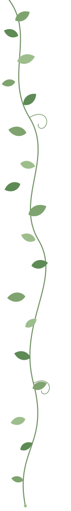

# Soumya — personal academic website

A plain HTML/CSS site. It has no build step and no framework. You can open `index.html` in a browser to preview it.

```
index.html        home (summary of everything)
research.html     papers with tl;dr toggles
projects.html
notes.html        reading notes with topic filter
travel.html
kitchen.html
off.html          off the clock
assets/
  css/style.css   all styling: colours, fonts, vine settings at the top
  js/site.js      reading-notes filter (the only JavaScript)
  vines/          the vine artwork, as editable SVG files
    vine-long.svg
    vine-short.svg
    branch.svg    the leafy branches beside your name
  img/            create this folder for your photos
```

## Host it free on GitHub Pages

1. Create a GitHub repository named `<your-username>.github.io`.
2. Upload everything in this folder to it, keeping the folder structure.
3. In the repository, go to **Settings → Pages**. Under "Build and deployment", choose **Deploy from a branch**, then pick `main` and `/ (root)`, and save.
4. After a minute or two the site is live at `https://<your-username>.github.io`.

Netlify and Cloudflare Pages also work. You can drag the folder into their dashboards. McGill web space works too: upload the files as they are.

## Fill in your details

Everything I didn't know is in square brackets, like `[SURNAME]`, `[PAPER TITLE]` and `[DATE]`. Search all the files for `[` to find them. Links that don't point anywhere yet are `href="#"`.

**Photos.** Put your images in `assets/img/`. Each placeholder has a comment right above it showing the `` line to swap in. For example:

```html

```

The ratio classes are `ratio-45` (portrait), `ratio-43` (landscape) and `ratio-11` (square).

## Change the vines

**Colours and shapes.** Open any file in `assets/vines/` in a text editor. The `<style>` block at the top controls the colours:

```css
.stem { stroke: #6E8F62; }   /* the stalk */
.a { fill: #7FA36F; }        /* three leaf greens */
.b { fill: #5E8A55; }
.c { fill: #9DBE8C; }
```

The leaf shape is the `#leaf` path. Each `<use>` line places one leaf using `translate(x y) rotate(degrees) scale(size)`. Copy a line to add a leaf, or delete one to remove it. In `branch.svg`, `.berry` sets the colour of the small berries.

**Placement.** Each page has a few lines near the top of `<body>` like this:

```html

```

- To switch sides, change `vine--left` to `vine--right`. Right-side vines are mirrored automatically.
- To move a vine down the page, change `--top`.
- To swap the artwork, point `src` at a different SVG.
- To remove a vine, delete its line.

**Size and strength.** Edit these at the top of `style.css`:

```css
--vine-width: 140px;
--vine-opacity: 1;
```

The vines fade on smaller screens so they don't compete with the text. To hide them on one page, add `class="no-vines"` to that page's `<body>`.

**Your own artwork.** You can drop in any transparent SVG or PNG, for example an illustration you've drawn or licensed. Point the `src` at it.

## Change the accent colour

Set `--accent` at the top of `style.css`. Suggested alternatives are in the comment next to it. If you change it, also update `.berry` in `branch.svg` so the berries match.

## Add content

- **News item:** copy a `<div class="news-item">` line in `index.html`.
- **Paper:** copy an `<article class="paper">` block in `research.html`. The tl;dr is a `<details>` element, so it works without JavaScript.
- **Reading note:** copy an `<a class="note">` block in `notes.html`. Set `data-tag` to `privacy`, `agents` or `interp` so the filter picks it up.
- **Travel stamp:** copy a `<div class="stamp">`. `--tilt` sets how crooked the stamp sits.

The home page shows summaries, so when you add something important, add it to `index.html` as well as its own page.
